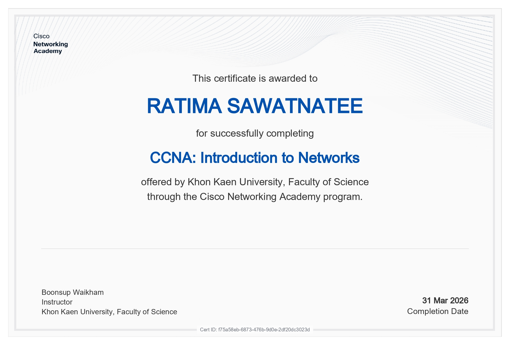
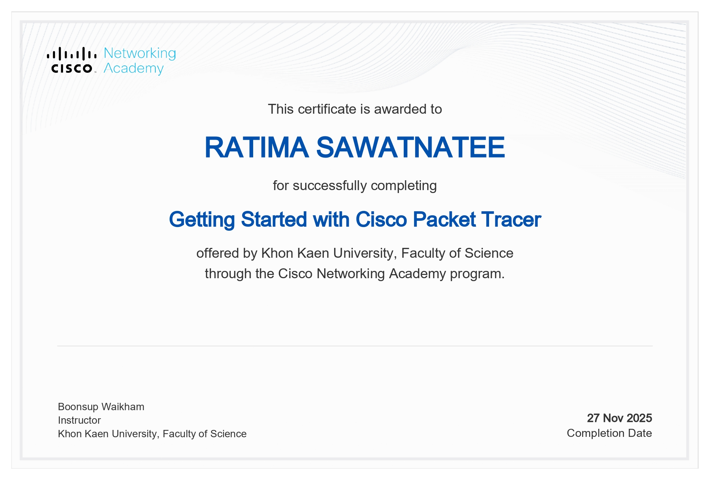

# Network-Portfolio

**[ใส่ชื่อ-นามสกุลจริง] รหัสนักศึกษา [ใส่รหัส 11 ตัว] Section [ใส่เลขเซค]**

Email : [[ใส่อีเมล@kkumail.com]](mailto:[ใส่อีเมล@kkumail.com])

---

## Portfolio – Networks

This repository contains my assignments, labs, projects, and certificates related to Computer Networks and Network Programming.

---

### 📄 Personal Assignment

| Assignment | File |
| :--- | :--- |
| Personal Essay | [Personal essay.pdf](Personal%20Assignment/Personal%20essay.pdf) |
| Assignment 2 (Topology) | [Assignment 2.pdf](Personal%20Assignment/Assignment%202.pdf) |
| Assignment 3 (Not Simple) | [Assignment 3.pdf](Personal%20Assignment/Assignment%203.pdf) |
| Assignment 4 (TCP-UDP) | [Assingment 4.pdf](Personal%20Assignment/Assingment%204.pdf) |
| LAB 1 (Personal) | [LAB 1 (2).pdf](Personal%20Assignment/LAB%201%20(2).pdf) |

---

### LAB (1-5)

| LAB | PDF File |
| :--- | :--- |
| LAB 1 | [LAB 1.pdf](LAB/LAB%201.pdf) |
| LAB 2 | [LAB 2.pdf](LAB/LAB%202.pdf) |
| LAB 3 | [LAB 3.pdf](LAB/LAB%203.pdf) |
| LAB 4 | [LAB 4.pdf](LAB/LAB%204.pdf) |
| LAB 5 | [LAB 5 .pdf](LAB/LAB%205%20.pdf) |

---

### Final Project
**GitHub** : https://github.com/zamzibedsingha/networkprogramming2025
**Video** : [ใส่ลิงก์ YouTube พรีเซนต์งาน ถ้ามี หรือถ้าไม่มีก็ลบบรรทัดนี้ทิ้งได้เลยครับ]

---

## 🏆 เกียรติบัตร (Certificate)

**CCNA: Introduction to Networks**

**Getting Started with Cisco Packet Tracer**

---

## ✅ Checkpoint Exam
